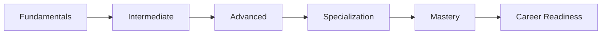
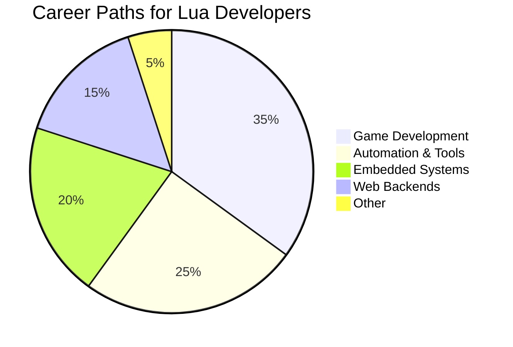

# 🚀 Lua Mastery Roadmap Course


## 📖 Overview

**A complete, project-based learning experience** designed to take you from Lua beginner to industry-ready expert. This repository contains the full curriculum structured around the official [Lua Mastery Roadmap](https://github.com/yourusername/lua-mastery-roadmap), covering foundational skills, advanced techniques, specialization areas, and professional development.



---

## 🌟 Why Learn Lua?

- 🎮 Powers **Roblox** (200M+ users), **World of Warcraft**, and many AAA games
  
- ⚙️ Embedded in **Redis**, **NGINX**, and over **70% of modern game engines**
  
- 🧠 Core scripting for tools like **Neovim**, **AwesomeWM**, and IoT platforms
  
- 💼 Exceptional **job-to-developer ratio** in specialized industries
  

---

## 📚 Course Structure

### 🧱 Phase 1: Core Fundamentals

- **Lesson 1**: Syntax & Variables
  
- **Lesson 2**: Control Flow & Functions
  
- **Lesson 3**: Deep Dive into Tables
  
- **Project**: CLI Inventory System
  

---

### 🔁 Phase 2: Intermediate Concepts

- **Lesson 4**: Modules & Scoping
  
- **Lesson 5**: Error Handling & File I/O
  
- **Lesson 6**: String Patterns & Coroutines
  
- **Project**: Config Parser + RPG Engine
  

---

### 🚀 Phase 3: Advanced Techniques

- **Lesson 7**: Metatables & OOP
  
- **Lesson 8**: LuaJIT & Performance Tuning
  
- **Lesson 9**: Sandboxing & Debugging
  
- **Project**: Plugin System + Task Scheduler
  

---

### 🎯 Specialization Tracks

Choose your niche:

```
🕹️ Game Development (Love2D, Roblox)  
💻 Neovim Ecosystem (LSP, Treesitter)  
🔌 Embedded Systems (Redis, ESP32)  
🌐 Web Backends (OpenResty, Lapis)  
🤖 Automation & Tools (CLI apps, Pandoc)
```

---

## 💼 Career Preparation

- Build a polished, project-rich portfolio
  
- Practice with real-world technical interview questions
  
- Download Lua-focused resume and CV templates
  

---

## 🚦 Getting Started

### Prerequisites

- Basic programming experience
  
- Lua 5.1+ or LuaJIT installed
  
- Code editor: [VSCode](https://code.visualstudio.com/) or [Neovim](https://neovim.io/)
  

---

### Installation

```bash
# Clone the course repo
git clone https://github.com/hetfs/Lua.git

# (Optional) Install useful tools
luarocks install busted    # Testing framework
luarocks install luacheck  # Linter
```

---

## 🏗️ Project Showcase

| Project | Difficulty | Track |
| --- | --- | --- |
| Roblox Obby Creator | ⭐⭐  | Game Dev |
| Neovim AI Assistant | ⭐⭐⭐ | Tools |
| IoT Sensor Monitor | ⭐⭐  | Embedded |
| OpenResty API Gateway | ⭐⭐⭐ | Web Backend |
| Pandoc Document Pipeline | ⭐   | Automation |

---

## 👨‍🏫 Learning Path Strategy

1. **Follow the Sequence**  
  Complete Phases 1–3 before diving into a specialization.
  
2. **Build by Doing**  
  Finish all core projects to reinforce key concepts.
  
3. **Develop a Portfolio**  
  Complete at least two specialization projects.
  
4. **Engage with the Community**  
  Contribute to Lua-based open source projects.
  

```lua
-- Sample Progress Tracker
function is_ready_for_jobs()
  return completed_projects >= 5 
    and has_specialization 
    and github_portfolio_updated
end
```

---

## 🤝 Contributing

We welcome your input! Start here:

- [Contribution Guidelines](https://chatgpt.com/c/CONTRIBUTING.md)
  
- [Project Ideas](https://chatgpt.com/c/IDEAS.md)
  
- [Translation Guide](https://chatgpt.com/c/TRANSLATING.md)
  

---

## 📜 License

### ⚖️ Code License: MIT

This course content is under [Creative Commons Attribution 4.0](https://chatgpt.com/c/LICENSE). All example code is MIT licensed.

---

## 🌐 Resources & Community

- 📘 [Lua Official Docs](https://www.lua.org/docs.html)
  
- 💬 [Join Our Discord](https://discord.gg/your-invite)
  
- 🗺️ [View Roadmap](https://yourdomain.com/roadmap)
  
- ⚡ [Interactive Playground](https://replit.com/@yourusername/lua-mastery)
  

---

**Start mastering Lua today.**  
[](https://gitpod.io/#https://github.com/yourusername/lua-mastery-course)



---
