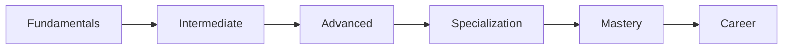
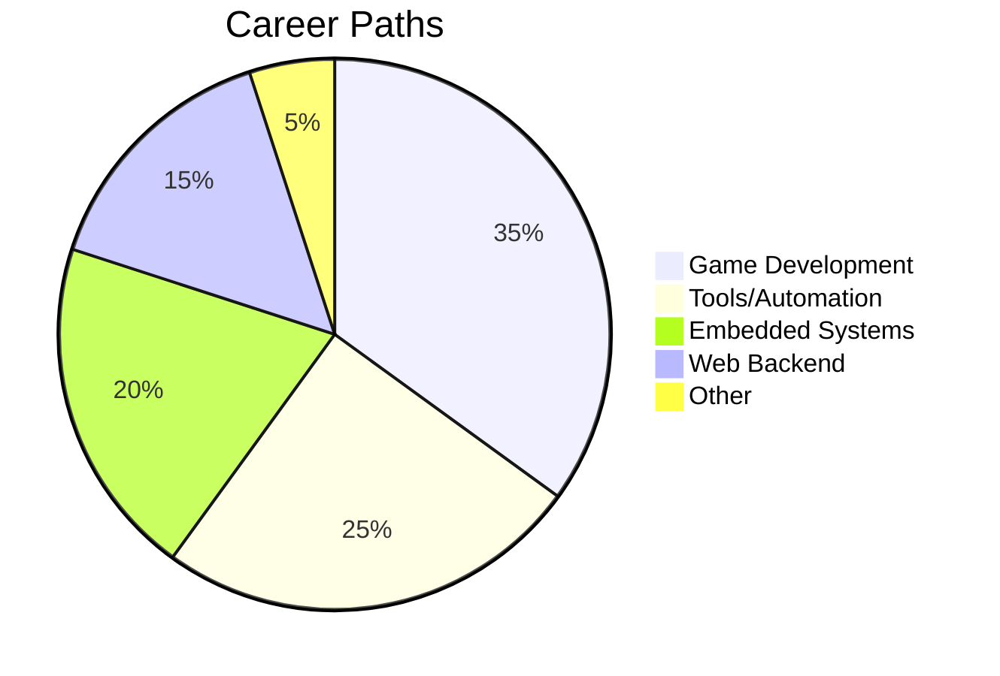

# Lua Mastery Roadmap Course 🚀


## 📖 Overview
**A comprehensive, project-based course** to take you from Lua beginner to career-ready professional. This repository hosts the complete curriculum following the structured [Lua Mastery Roadmap](https://github.com/yourusername/lua-mastery-roadmap), covering fundamentals, advanced concepts, specialization tracks, and career preparation.



## 🌟 Why Learn Lua?
- 🔹 Powers Roblox, World of Warcraft, and 70% of AAA games
- 🔹 Embedded in Redis, NGINX, and IoT devices
- 🔹 Core scripting for Neovim and AwesomeWM
- 🔹 Top 20 most popular programming languages
- 🔹 Highest job-to-developer ratio in niche domains

## 📚 Course Structure

### Phase 1: Core Fundamentals
- [ ] **Lesson 1**: Syntax & Variables
- [ ] **Lesson 2**: Control Flow & Functions
- [ ] **Lesson 3**: Tables Deep Dive
- [ ] **Project**: CLI Inventory System

### Phase 2: Intermediate Concepts
- [ ] **Lesson 4**: Modules & Scoping
- [ ] **Lesson 5**: Error Handling & File I/O
- [ ] **Lesson 6**: String Patterns & Coroutines
- [ ] **Project**: Config Parser & RPG Engine

### Phase 3: Advanced Techniques
- [ ] **Lesson 7**: Metatables & OOP
- [ ] **Lesson 8**: LuaJIT & Performance
- [ ] **Lesson 9**: Sandboxing & Debugging
- [ ] **Project**: Plugin System & Task Scheduler

### Specialization Tracks
```
🕹️ Game Dev    | 💻 Neovim | 🔌 Embedded
🌐 Web/Backend  | 🤖 Automation
```

### Career Preparation
- Portfolio Building Guide
- Lua Resume Templates
- Technical Interview Prep

## 🛠️ Getting Started

### Prerequisites
- Basic programming knowledge
- Lua 5.1+ or LuaJIT installed
- Code editor (VS Code/Neovim recommended)

### Installation
```bash
# Clone repository
git clone https://github.com/yourusername/lua-mastery-course.git

# Install dependencies (optional)
luarocks install busted  # Testing framework
luarocks install luacheck # Linter
```

## 🧪 Course Projects Preview
| Project | Difficulty | Specialization |
|---------|------------|---------------|
| Roblox Obby Creator | ⭐⭐ | Game Dev |
| Neovim AI Assistant | ⭐⭐⭐ | Tools |
| IoT Sensor Monitor | ⭐⭐ | Embedded |
| OpenResty API Gateway | ⭐⭐⭐ | Web |
| Pandoc Document Pipeline | ⭐ | Automation |

## 👨‍🏫 How to Use This Course
1. Complete lessons sequentially
2. Build all practice projects
3. Choose a specialization track
4. Contribute to community projects
5. Build your portfolio

```lua
-- Sample Learning Checkpoint
function validateProgress(phase)
  return hasCompletedProjects(phase) and 
         hasPassedQuizzes(phase)
end
```

## 🤝 Contributing
We welcome contributions! Please see:
- [Contribution Guidelines](CONTRIBUTING.md)
- [Project Ideas](IDEAS.md)
- [Translation Guide](TRANSLATING.md)

## 📜 License
This course is licensed under the [Creative Commons Attribution 4.0](LICENSE) license. All code samples are MIT licensed.

## 🌐 Resources & Community
- [Lua Official Documentation](https://www.lua.org/docs.html)
- [Discord Study Group](https://discord.gg/your-invite)
- [Roadmap Visualization](https://yourdomain.com/roadmap)
- [Interactive Lua Playground](https://replit.com/@yourusername/lua-mastery)

---

**Start your Lua journey today!**  
[](https://gitpod.io/#https://github.com/yourusername/lua-mastery-course)


